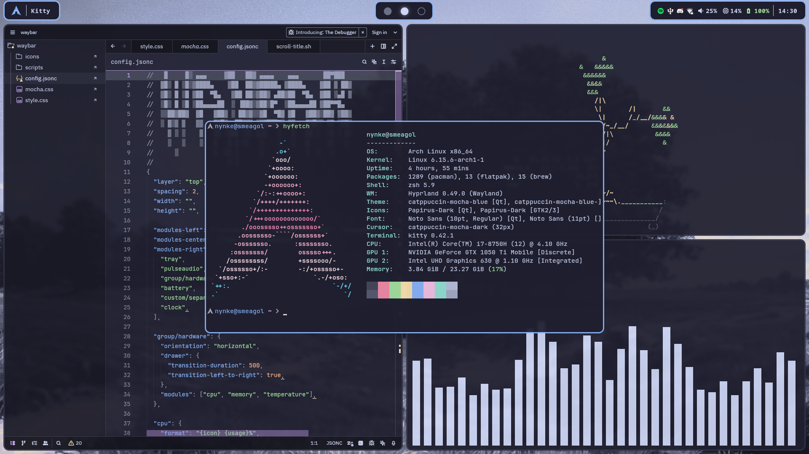
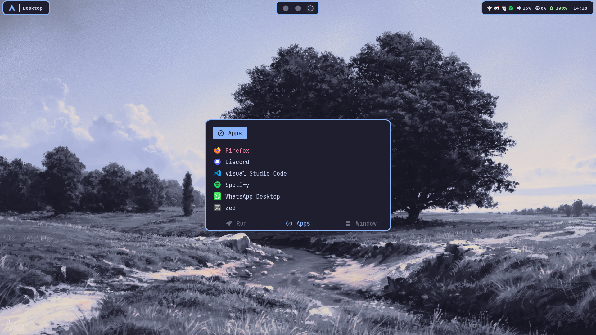

# Dotfiles
My hyprland dotfiles that I've been working on!

<details>
<summary>Screenshots</summary>



</details>

# Installation
## Clone the repository
```sh
git clone https://github.com/mustard4868/dotfiles .dotfiles && cd .dotfiles
```
## Run the install script
```sh
./install.sh
```

# Changing distro themes.
When running `git pull` the theme will revert back to the default colors.
You can run `./update_distro.sh` to reset the colors to those of another distro.
